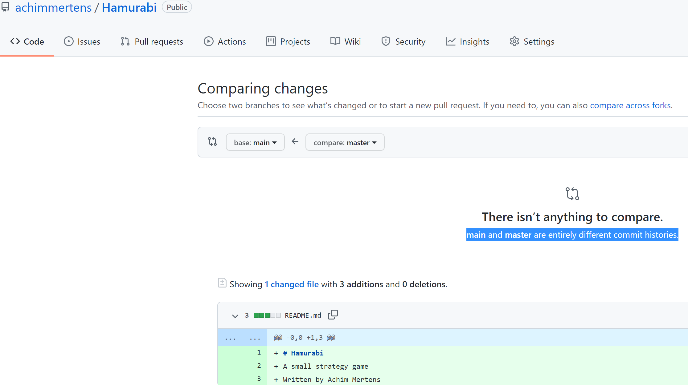
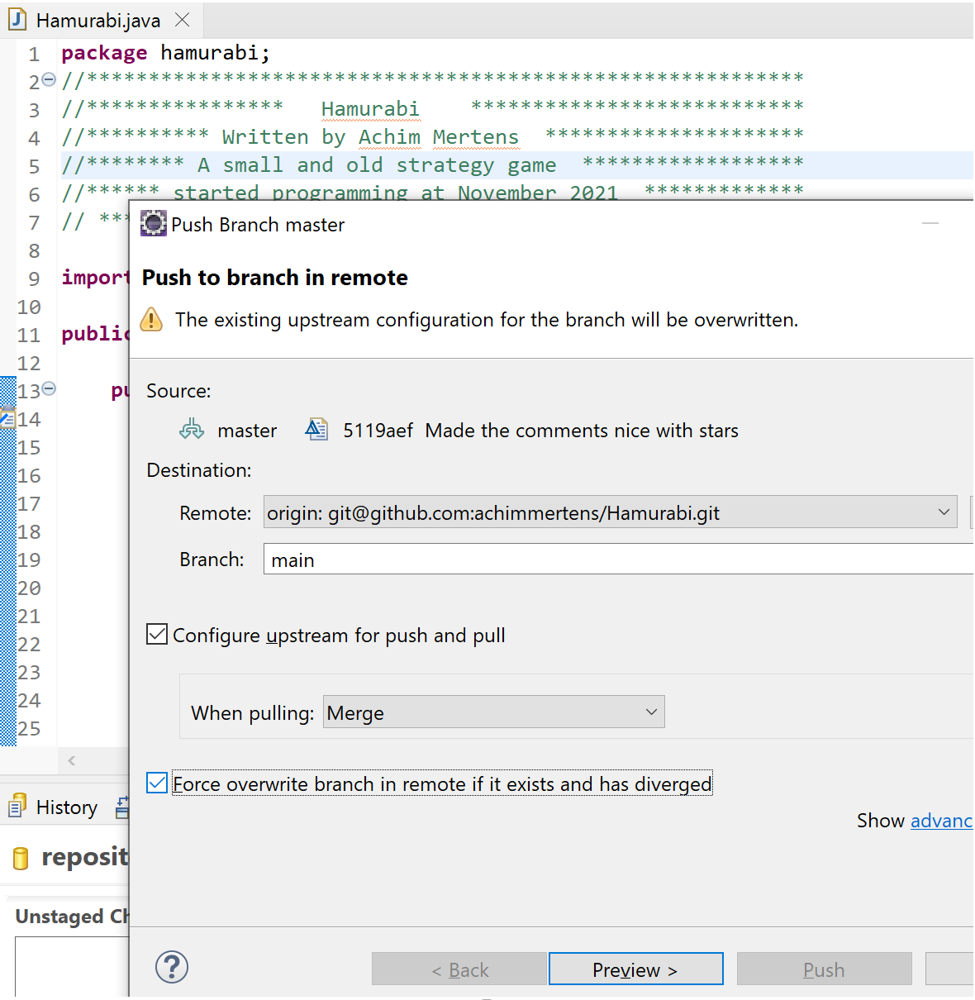
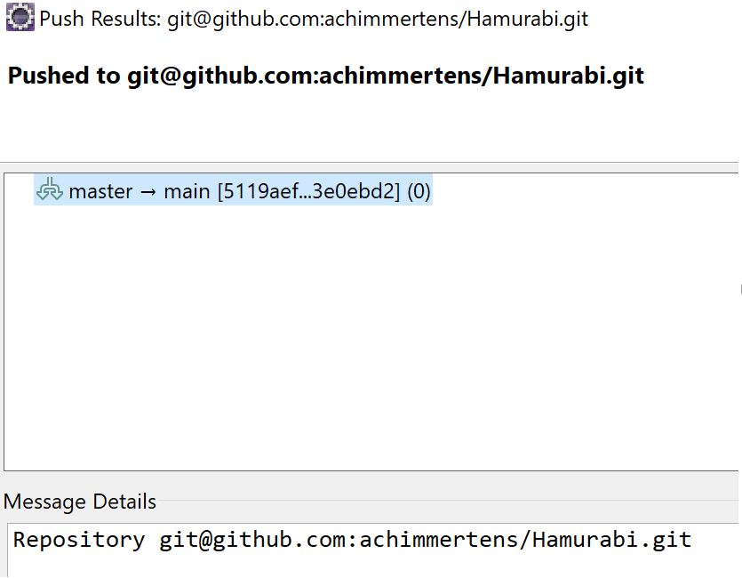
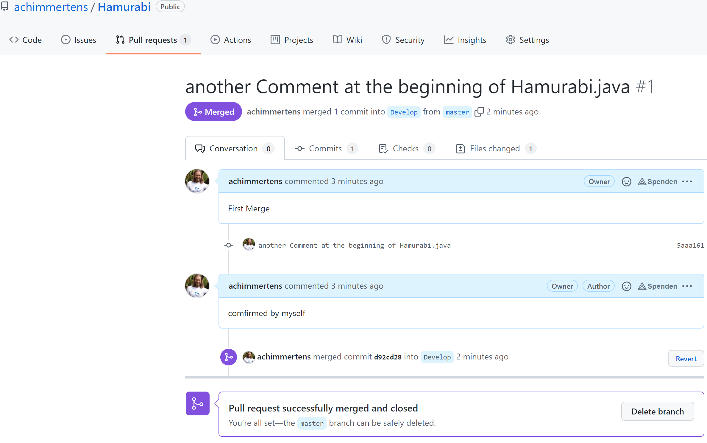

Hello,

here I describe how I merged two new and different branches in my github repository "Hamurabi".

# The Problem

I have created a main branch by default.
But my code was uploaded into the "Master" branch.
Now I want to merge both, but I get a error message on github, when I try a merge request:
"main and master are entirely different commit histories."

# This is what worked out:
In Eclipse, do you changes, commit them and then click on "push HEAD".
In the following dialog choose a different branch:

I repeated this for the branch "Develop".

After that I was able to merge both (master and Develop) branches:

xxx
yyy